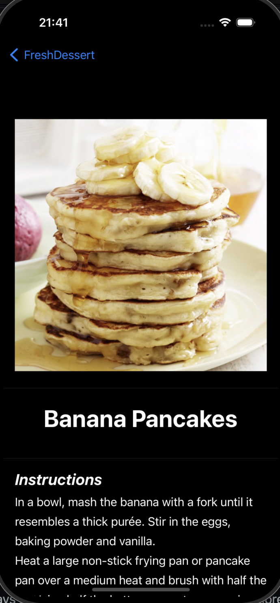

# 🍧 FreshDessert
## A one stop shop for all your favorite delicious desserts - right at your fingertips!

<div align="center">
  
</div>

FreshDessert is a **SwiftUI**-based iOS app that displays a list of delicious desserts. Users can explore details of each dessert, including ingredients and instructions.

## Features

- List View of various desserts
- Navigation to detailed dessert View, allowing you to see more details on what you are interested in the most
- Integration with a [TheMealDB API](https://themealdb.com) for real data

## Setup

1. Either download the Zip file for this repository, or you can clone it at:

```bash
git clone [https://github.com/yourusername/FreshDessert.git](https://github.com/jpzoll/FreshDesserts.git)https://github.com/jpzoll/FreshDesserts.git
cd FreshDessert
```

2. Once you have the repo unzipped and on your local machine, open the solution in Xcode and you're all set!
